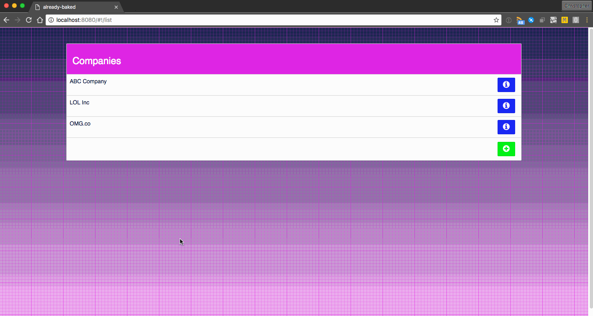

# already-baked

> A Vue.js project



## Special Note

This is a demo project I built for [a meetup presentation](https://www.meetup.com/SaintLouis_FullStack_WebDevelopment/events/231969178/). I slapped it together over the course of a couple of breakfasts and a late night session or two. That is to say; there are some parts that are unfinished, the styling is really only geared towards Chrome, and there are parts that probably could be cleaner or structured differently. 

The purpose of this project is to highlight various features and abilities of vue.js and accompanying tools. 

## Build Setup

``` bash
# install dependencies
npm install

# serve with hot reload at localhost:8080
npm run dev

# build for production with minification
npm run build
```

## This Project Uses
- [vue.js](http://vuejs.org/)
- [webpack](https://webpack.github.io/)
    + With various supporting loaders
- [vue-router](https://github.com/vuejs/vue-router)
- [vue-resource](https://github.com/vuejs/vue-resource) (though it's not fully implemented)
- [Font Awesome](http://fontawesome.io/)
- [Bootstrap-sass](http://getbootstrap.com/)
- [Animate.css](https://daneden.github.io/animate.css/)
- [Dropzone.js](http://www.dropzonejs.com/)
- [Sass](http://sass-lang.com/)
- Custom shared state
